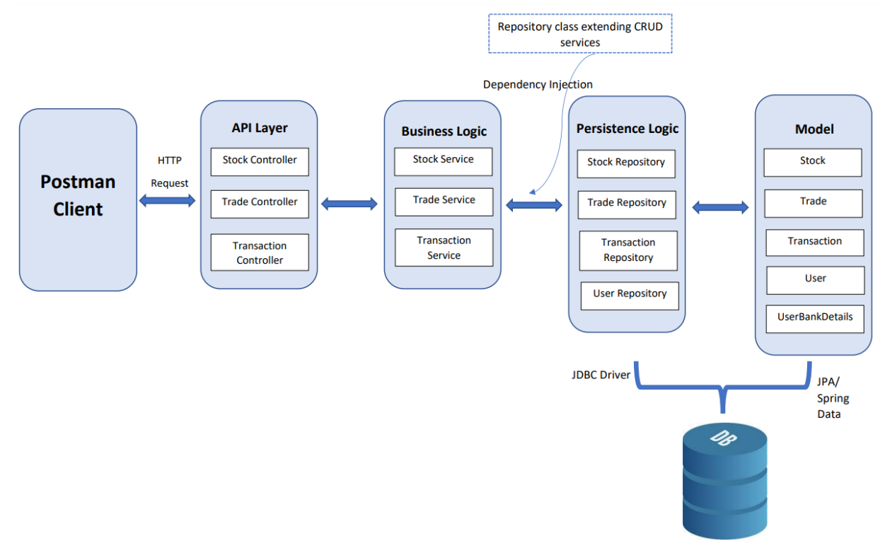
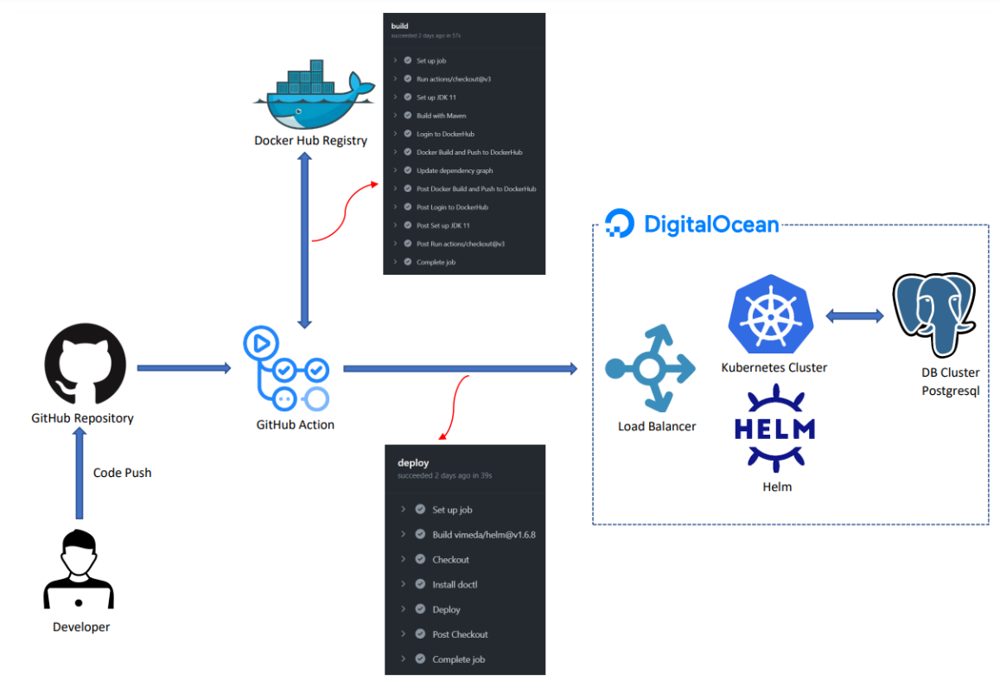
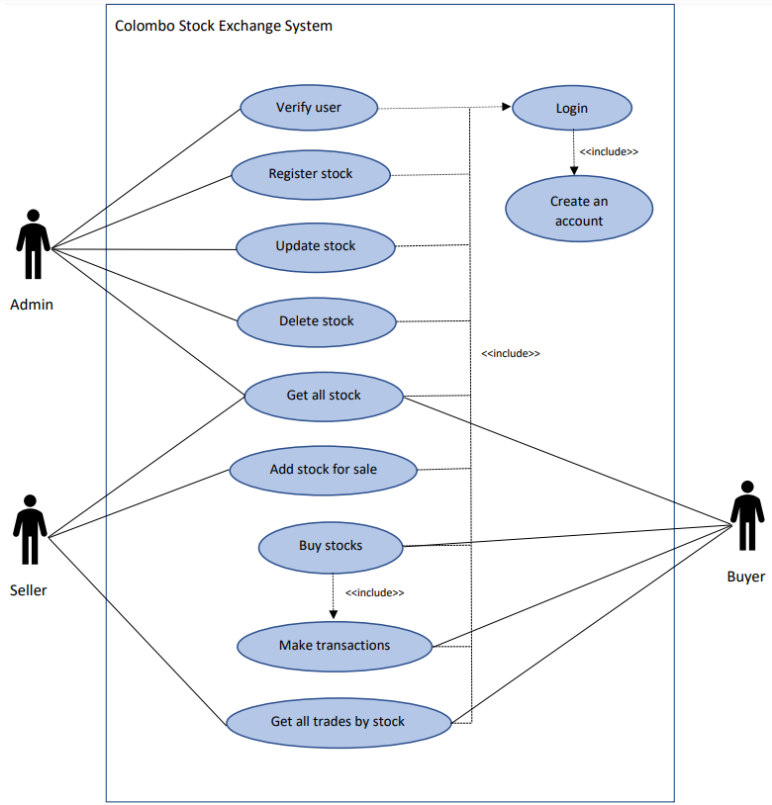

# colombo-stock-exchange-service
_Cloud Computing Applications - Course Work - 1_

## Technologies
- Apache Maven 3.8.6
- Spring Boot 2.2.7
- Java 11
- Postgres 14

## Solution Architecture


## Deployment Architecture


## Features - Usecase diagram


## Configuration

> Create a database in Postgres and please configure [_application.properties_](src/main/resources/application.properties) with your `Host, DB name, Username, Password` details.

## Build the project

Please run below command in project root:

```sh
mvn clean install
```

## Run the project

Please run below commands in project root:

```sh
cd target
java -jar stock-exchange-0.0.1.jar
```

## Postman Collection

> You can import [_postman collection_](postman collection/colombo-stock-exchange.postman_collection.json) into your postman workspace and see all the REST APIs with json requests which are included with success, unsuccess and validations checking sample responses.

----------
